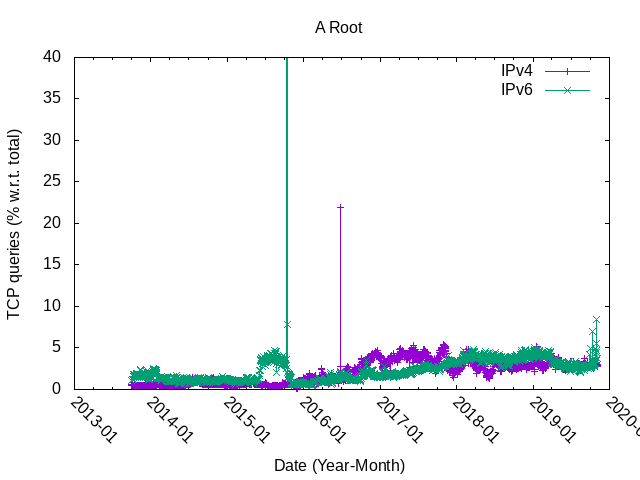

# root-RSSAC002-timeseries

  * Show timeseries of TCP queries for Root DNS server
  * Uses data from https://github.com/rssac-caucus/RSSAC002-data

## Ratio of TCP queries per Root Server Letter

     * *A ROOT*: 
